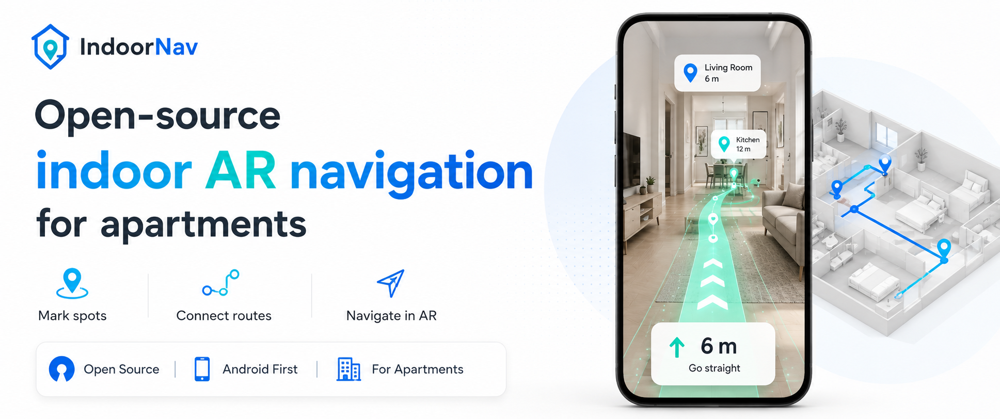

# Indoor Nav

**Indoor Nav** is an open-source indoor navigation app for apartments: mark rooms and doors, build a route graph, and navigate in AR.

Navigation is the product; localization is a replaceable plug-in. One app, two modes — Map and Navigate. Uses Google’s ARCore `hello_ar_kotlin` sample as the rendering base.

- **App module:** [`app/`](app/) (`com.google.ar.core.examples.kotlin.helloar`)
- **Localization today:** Google Cloud Anchors (v1) — works, but limited (see below)
- **Next localization:** Indoor Spatial Platform (ISP) — [docs/future-plan.md](docs/future-plan.md)

---

## Limitations (why ISP)

Cloud Anchors are fine for a prototype, not for reliable everyday navigation:

- Pins can fail to resolve until you walk and rescan the room again
- Hosted anchors expire (~24h with an API key), so markers do not last
- Mapping feels fragile — lighting, featureless walls, and quotas all hurt quality

That is why the next major localization phase is **ISP** (Indoor Spatial Platform): a self-hosted indoor map / VPS-style backend behind the same `LocalizationBackend` plug-in, so **Indoor Nav** keeps the nav product and swaps out the weak cloud-anchor layer. Details: [docs/future-plan.md](docs/future-plan.md).

---

## Quick start

1. Phone + USB debugging → [docs/setup.md](docs/setup.md)

2. **API key** (required for saving markers to the cloud):
   1. Enable [ARCore API](https://console.cloud.google.com/apis/library/arcore.googleapis.com) in Google Cloud.
   2. [Create an API key](https://console.cloud.google.com/apis/credentials) (Credentials → Create credentials → API key).
   3. Open `app/local.properties` and add (no quotes, no spaces around `=`):

```properties
ARCORE_API_KEY=paste_your_key_here
```

   Full steps (restrict key, billing, troubleshooting): [docs/cloud-anchors.md](docs/cloud-anchors.md)  
   Do **not** commit `local.properties` — it is gitignored.

3. Install:

```powershell
cd "d:\indoor map\app"
.\gradlew.bat installDebug
```

4. Map mode → mark spots (Wi‑Fi on) → wait for cloud host success → reopen and walk rooms to resolve pins

How to walk and mark your home: [docs/phone-capture.md](docs/phone-capture.md)

---

## Documentation

All project docs live in [`docs/`](docs/README.md).

| Doc | What it’s for |
|-----|----------------|
| [docs/plan.md](docs/plan.md) | Indoor Nav product roadmap |
| [docs/future-plan.md](docs/future-plan.md) | ISP / IndoorVPS track |
| [docs/architecture.md](docs/architecture.md) | Localization plug-in |
| [docs/cloud-anchors.md](docs/cloud-anchors.md) | API key & quotas |
| [docs/setup.md](docs/setup.md) | Phone setup & install |
| [docs/phone-capture.md](docs/phone-capture.md) | Mapping an apartment |

Upstream ARCore SDK (reference): [google-ar/arcore-android-sdk](https://github.com/google-ar/arcore-android-sdk)

---

## Architecture (short)

```
Apartment import (future) → Internal map → Waypoints → Graph → A*
                              │
                    ┌─────────┴─────────┐
                    │                   │
               2D Navigation      AR Navigation
                    │                   │
                    └─────────┬─────────┘
                              │
                       LocalizationBackend
                              │
              Cloud Anchors (today) | ISP client (future)
```

Details: [docs/architecture.md](docs/architecture.md) · phases: [docs/plan.md](docs/plan.md)

**Do not** commit API keys or `client_secret*.json`. Put the key only in `app/local.properties` as `ARCORE_API_KEY=…` (gitignored).

---

## Current status

**Phase 1 (core) — done:** AR Map/Navigate (no 2D floor plan yet), waypoints + save/load, A* + connections, Cloud Anchors, path cues.

**Next:** Phase 2 — navigation platform. See [docs/plan.md](docs/plan.md).  
**ISP:** better localization so users stop depending on constant rescans — [docs/future-plan.md](docs/future-plan.md).  
**Not building in this repo:** CAD editor, OpenVPS/RTAB/ORB-SLAM.

---

## License

Copyright 2026 **Shahtab**. Indoor Nav is licensed under the [Apache License 2.0](LICENSE). See [NOTICE](NOTICE) for Google ARCore sample attribution.

Upstream ARCore SDK: [google-ar/arcore-android-sdk](https://github.com/google-ar/arcore-android-sdk).
